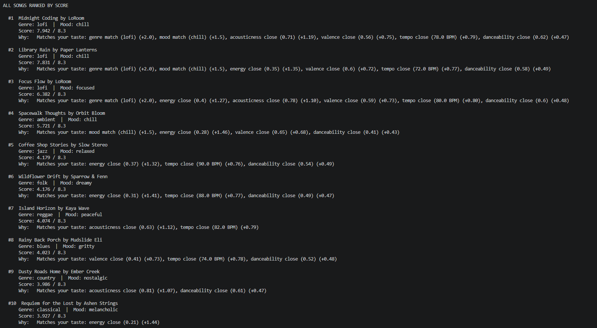
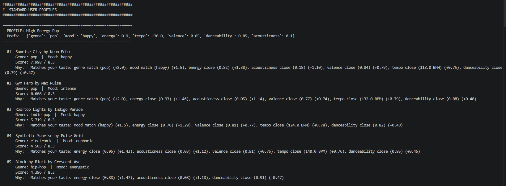
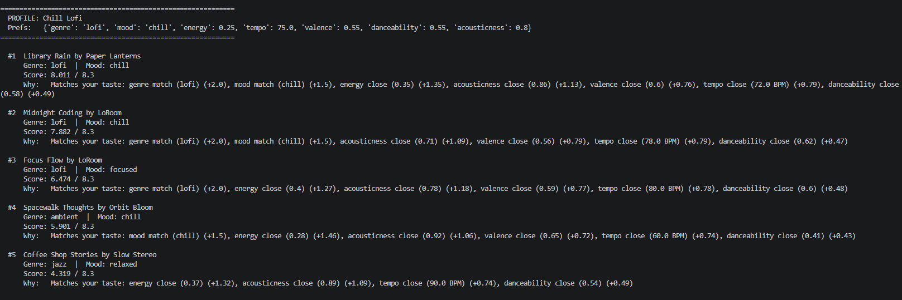
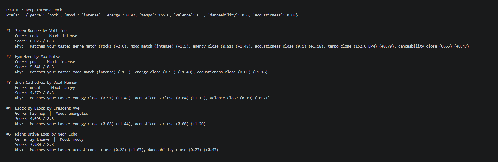
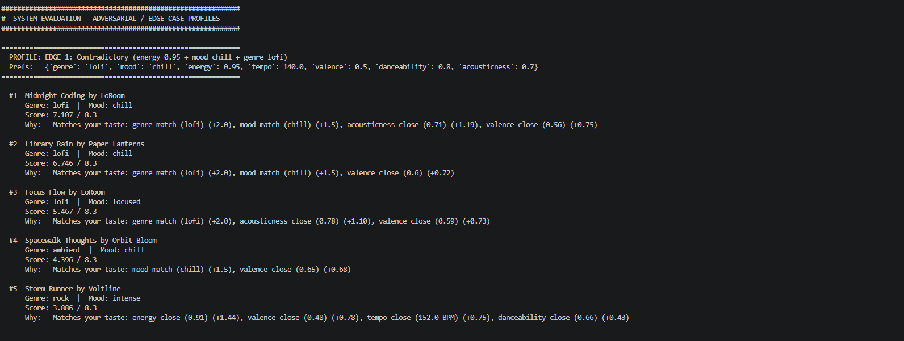
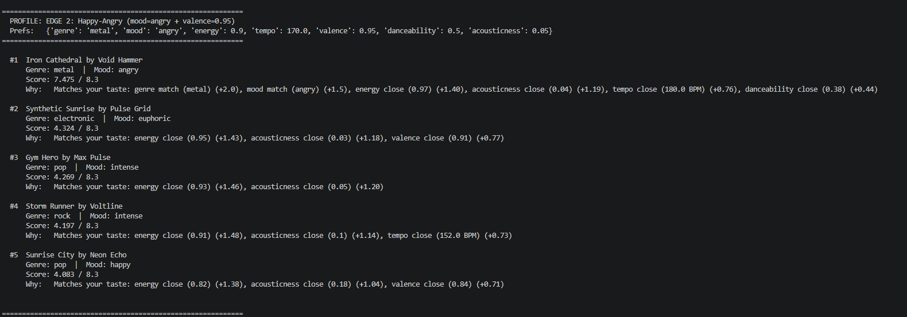
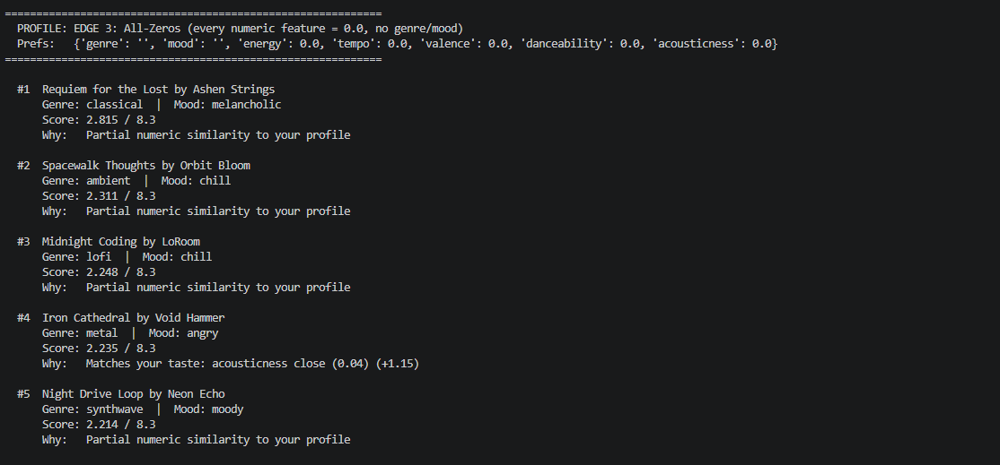
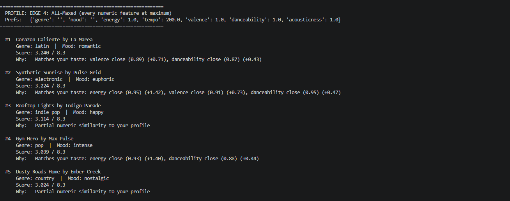
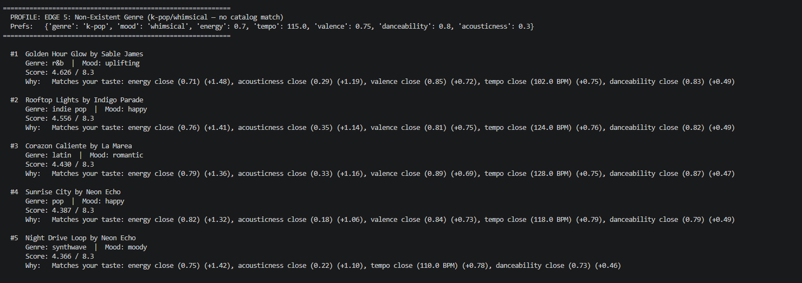

# 🎵 Music Recommender Simulation

## Project Summary

In this project you will build and explain a small music recommender system.

Your goal is to:

- Represent songs and a user "taste profile" as data
- Design a scoring rule that turns that data into recommendations
- Evaluate what your system gets right and wrong
- Reflect on how this mirrors real world AI recommenders

---

## How The System Works

There are two ways that music recommending systems work, we have the collaborative filtering and the content-based filtering. Collaborative filtering work by using other users as a way to recommend a song. For example, if two users have the similar task in music such as they both like Lady Gaga, Bad Bunny, and Rock, then if User A likes Bruno Mars, than there is a high chance that User B will also enjoy Bruno Mars. Then there is content-based filtering which uses the audio characteristics of a song to provide a personal recommendation, such as tempo, mood, genre, danceability, etc. Since this project doesnt more than one user the method to recommend songs will be content-based were the characteristics of a song will determine whether it will be recommended or not. 


Some prompts to answer:

- What features does each `Song` use in your system
  - genre, mood, energy, tempo_bpm, valence, danceability, and acousticness
- What information does your `UserProfile` store
  - The taste profile stores the user's target values for every feature: a preferred genre label, a preferred mood label, and numeric targets for energy, tempo, valence, danceability, and acousticness.
- How does your `Recommender` compute a score for each song
  - Every song in the catalog is scored — no song is dropped early. A song that misses on genre and mood still receives numeric similarity points, so sonically close songs always surface.
  - **Step 1 — Categorical bonuses (binary):** If the song's genre exactly matches the user's preferred genre, add +2.0. If the mood matches, add +1.5. These fire or they don't; there is no partial credit.
  - **Step 2 — Continuous similarity:** For each numeric feature, compute `similarity = 1.0 − |song_value − target_value|`. This gives 1.0 for a perfect match and 0.0 when the values are as far apart as possible.
  - **Step 3 — Weighted sum:** Multiply each similarity by its feature weight and add to the score. Weights reflect how strongly each feature separates genres in the catalog:
    ```
    energy        × 1.5   (widest spread: 0.21–0.97)
    acousticness  × 1.2   (covers full range; separates electric from acoustic)
    valence       × 0.8   (emotional tone; partially overlaps with mood label)
    tempo         × 0.8   (normalized ÷ 200 first, or raw BPM would dominate)
    danceability  × 0.5   (weakest separator; correlated with energy)
    ```
  - **Max possible score ≈ 8.3** (genre match 2.0 + mood match 1.5 + all five numeric features at perfect similarity).
- How do you choose which songs to recommend
  - All 20 scored tuples are sorted in descending order by score. The top `k` (default 5) are returned. The song closest to the user's full taste profile — across both categorical and numeric dimensions — ranks first.


Some biases of this system is that Genre could be over prioritized, meaning that other features might be shadowed and effect the user recommendation. This is also an issue especially if the user want something that sounds similar to a genre, but isnt really that genre. 




---

## Getting Started

### Setup

1. Create a virtual environment (optional but recommended):

   ```bash
   python -m venv .venv
   source .venv/bin/activate      # Mac or Linux
   .venv\Scripts\activate         # Windows

2. Install dependencies

```bash
pip install -r requirements.txt
```

3. Run the app:

```bash
python -m src.main
```

### Running Tests

Run the starter tests with:

```bash
pytest
```

You can add more tests in `tests/test_recommender.py`.

---

## Experiments You Tried

**Experiment 1 — Genre weight from 2.0 to 0.5:**
Lowering genre's bonus let sonically similar songs from other genres rank higher. "Gym Hero" (pop) dropped below "Synthetic Sunrise" (electronic) for the Pop profile because numeric features like energy and danceability carried more influence. This showed how much the categorical bonus dominates rankings.

**Experiment 2 — Adding tempo and valence:**
Before adding these, songs that shared genre and energy often tied. With tempo (normalized by 200) and valence weighted at 0.8 each, the system could separate them. For Deep Intense Rock, "Iron Cathedral" rose because its low valence matched the dark preference.

**Experiment 3 — Different user types:**
Standard profiles worked well — Pop fans got pop songs, lofi fans got lofi. Edge cases revealed issues. The contradictory profile (high energy + chill mood + lofi genre) still ranked lofi songs first because the genre+mood bonus (3.5) outweighed the energy mismatch. The all-zeros profile treated 0.0 as a real target instead of "no preference," ranking the lowest-energy song first.

### All Songs Ranked by Score


### Standard User Profiles

**High-Energy Pop Profile**



**Chill Lofi Profile**



**Deep Intense Rock Profile**



### Adversarial / Edge-Case Profiles

**Edge 1: Contradictory (energy=0.95 + mood=chill + genre=lofi)**



**Edge 2: Happy-Angry (mood=angry + valence=0.95)**



**Edge 3: All-Zeros (every numeric feature = 0.0, no genre/mood)**



**Edge 4: All-Maxed (every numeric feature at maximum)**



**Edge 5: Non-Existent Genre (k-pop/whimsical - no catalog match)**



---

## Limitations and Risks

- Genre carries a big role in determining the song to recommend 
- Sometimes the song scoring is to similar and incorrect

---

## Reflection

Read and complete `model_card.md`:

[**Model Card**](model_card.md)

Write 1 to 2 paragraphs here about what you learned:

- What was your biggest learning moment during this project?
  My biggest learning moment during this project was learning how a recommendation system works and implementing a weight for each feature

- How did using AI tools help you, and when did you need to double-check them?
  Using AI tools helped a lot with the coding, but there would be times where the logic would be basic or simply didnt make sense and I would need to double check how it got to that conclusion. 

- What surprised you about how simple algorithms can still "feel" like recommendations?
  What surprised me was how the algorithms (or at least the one is this project) has a feature for everything inside the data. I had no idea you could quantify danceability and then use that to make song recommendation.

- What would you try next if you extended this project?
  I would try to make the weight system a bit more sophisticated. I would also try and add a bit of randomness to the algorithm and a way to roll out multiple recommendation and then have does recommendation compared to previous songs the user selected in order to see what the next best song would be.


